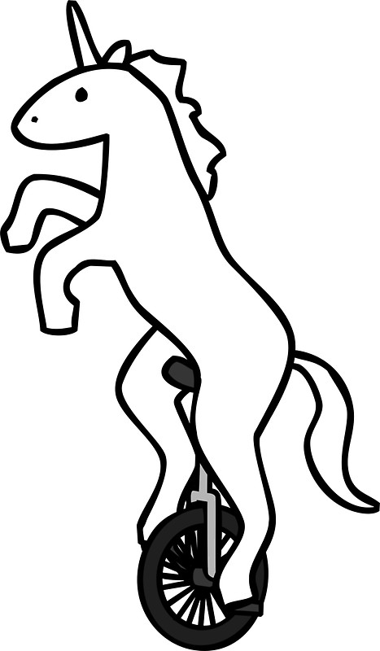

Unicorns on unicycles
================

   

About
-----

This is a repo containing all the known information about unicorns on unicycles, transcribed from original hoogduuts trough latin to English.

The documents were recently unearthed from a hidden chest in Delft and seem to be written by Rudolphus Hogervorstus, my great great great uncle, in 1681. These documents show that he was a scientist studying the then roaming herds of unicorns in the area around Delft. Unfortunately these animals are extinct now.

His work contains multiple tables, carefully written down, documenting the population of unicorns over time in multiple places and related to that the sales and numbers of unicycles in those countries.

According to Rudolphus the unicorn populations and unicycles are related "The presence of the cone on the unicorn hints at a very defined sense of equilibrium, it is therefore only natural to assume unicorns ride unicycles".

As part of the archival process these tables were copied, as Rudolphus himself would say: "with the black magic, so vile it could not be discussed for hell would come descent upon us" into satans own spawn: Microsoft Excel.

This 'raw' data gives us a nice example of typical dirty data you would find in the wild. The goal is to combine the sales data of unicycles and the populations of unicorns into a single 'tidy' dataframe.

##### other things

-   you would not believe how many unicorns on unicycles you can find
-   image from <http://www.socialsmiling.com>

 Unicorns on Unicycles by <a xmlns:cc="http://creativecommons.org/ns#" href="https://github.com/RMHogervorst/unicorns_on_unicycles" property="cc:attributionName" rel="cc:attributionURL">Roel M. Hogervorst</a> is licensed under a <a rel="license" href="http://creativecommons.org/licenses/by/4.0/">Creative Commons Attribution 4.0 International License</a>.

